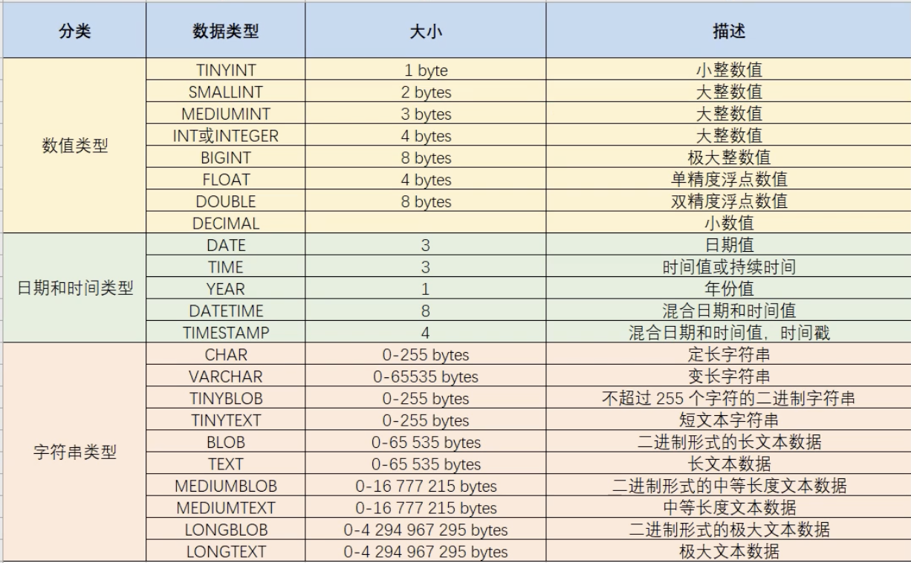

# 1.数据库的增删改查

```mysql
-- 查询所有数据
show databases;
-- 创建数据库
create database xxbg;
-- 创建数据库，如果不存在则创建，存在则创建
create database if not exists xxbg;
-- Mac特别提醒,出现乱码要指定编码
create database if not exists xxbg charset utf8;
-- 删除数据库
DROP database xxbg;
-- 如果存在则删除
drop database if exists xxbg;
-- 查看你当前正在使用的数据库
select database();
-- 使用指定的数据库
use xxbg;
-- 视频链接：https://www.bilibili.com/video/BV1FD4y1W77x?spm_id_from=333.788.videopod.sections&vd_source=1edc3e20c7a80f1d50c41c8fce9c98c7
```

# 2.数据表的查询操作

```mysql
-- 查询当前数据库下所有表的名称
show tables;
-- 查询表结构
desc 表名称;
-- Field ->表中字段信息  type ->该字段能够存储什么类型的数据()
-- null ->能不能是空值 
```

# 3. 操作表

## 3.1 创建表

```mysql
create table 表名 (
	字段名1 数据类型
  字段名2 数据类型
)
```

- mysql 数据类型
- 

- Mysql 常用数据选择

  - 1，数值型 —— tinyint (年龄)，int(整数数字)，double(小数数字)

  - 2，日期型—— date (年月日：生日) ，datetime(年月日分秒：提交订单时间/付款时间)

  - 3， 字符串型 —— char (定长字符串)：制定最多存储的字符个数，无论存多少个字符，都占用固定的空间

       varchar(变长字符串)：指定最多存储的字符个数，占多少个字符，就占多大的空间+1 ，实际空间大小。


## 3.2 例子


```mysql
create table students(
    sid int, -- 编号作为数据类型，int作为数据类型直接写即可
    name varchar (10),-- 姓名作为字符串类型，varchar/char作为数据类型后面要加一个().里面写最多存储的字符数。
    gender char (1),-- 只有一个字(定长字符串)
    birthday date , -- 生日选择日期类型，只有年月日选择date类型
    score double(5,2), -- 分数选择为数据类型，double作为数据类型，不建议只写一个double，建议在double的后面加上一个(m,n),m:数字的最大位数(整+小) n:数字的最大位数(小)
    email varchar(64),-- 邮件选择字符串类型，选择varchar变长字符串，(邮件的地址长度不一样)
    phone varchar(20),
    status tinyint  -- 状态选择数字类型，由于状态不是特别多，选择tinyint
    );
-- 视频链接：https://www.bilibili.com/video/BV1UY4y1f7jX?spm_id_from=333.788.videopod.sections&vd_source=1edc3e20c7a80f1d50c41c8fce9c98c7
```

```mysql
-- 删除当前数据库
drop table  if  exists a;
```

``` mysql
-- 修改表名
alter  table students rename  to student;
alter table  student rename to students;
-- 给学生表加一列 classroom，数据类型为varchar(10)
alter table students add classroom varchar(10);
-- 删除classroom列
alter table students drop  classroom;
-- 删除classroom列
alter table students drop  classroom;
```

## 3.2 DML语句

```mysql
-- 1.给指定列添加数据
insert into 表名(列名1,列名2,列名3,...) values(值1,值2,值3,...);
-- 全部列添加数据
insert into students
values (4, '666', '男', '2001-01-01', 100.00, 16651070150, 16651070149, 0);
-- 替换数据
-- 将'张二狗'的email改成143
update students set email='1439849190@qq.com', phone='12345678901' where name = '张二狗';
-- 删除某一行数据
delete from students where name = '张二狗';
```

## 3.3 条件查询

### 3.31 基础查询

```mysql
-- 思考1 先执行select还是from？
-- 答：先执行from再执行select
-- 思考2 执行完查询操作后，得到的是什么？
-- 答：得到的是一张表，只不过不存在于本地，是一张伪表。
```

```mysql
-- 查询表中的全部字段信息
select *
from students;

-- 查询表的部分字段
select name, gender
from students;
-- 到了公司不能上来就select *，会占用服务器资源。
-- distinct可以除去重复的数据，例如查询gender只剩下男女
select distinct gender from students;

-- 起别名查询
select s.name , s.gender from students  as  s ;
select s.name as '姓名', s.gender as '性别' from students  as  s ;-- as可以不写

-- 查询所有性别为男的学生信息
select *
from students
where gender = '男';
delete
from students
where name = '666';
-- 条件查询：范围过滤方式(列名 运算符 目标值) 运算符：> < >= <= <> !=
-- 范围可以判断的一半是数值或日期，一般不查字符串
select *
from students
where score >= 90;
-- mysql中越近的日期越大，越远的的日期越小
select *from students where birthday>'1999-01-01';
```

### 3.3.1 SQL语法查询

```mysql
-- sql语法条件查询：判断数值在范围之间 ，格式：列名，between 值1 and 值2，值1min,值2max
-- 查询所有分数处于99-100分之间的学生
select * from students where score between 99 and 100;

-- sql语法条件：in(...),判断数值在(...)中的某一个值，格式：列名 in (值1，...)
-- 查询所有分数是0或100的学生
select * from students where score  in (0,100);
```

### 3.3.2 模糊查询

```mysql
-- 模糊查询 ：格式，like
-- 模糊查询值：带有特殊标识符号的字符串。
-- 特殊的标识符号：_ ，表示任意一个字符匹配
-- 特殊的标识符号：%，表示任意N个字符匹配


-- 查询姓张的且是三个字的学生数据
select  *  from students where name like '张__';
-- 查询第三个字是狗的学生信息
select * from students where name like '%狗';
-- 查询是yaya邮箱的同学信息
select  * from students where email like '%ya%';
-- 查询手机号码带66的同学信息
select  *from students where phone like '%66%';
```

### 3.3.3 多条件连接查询与非空判断

- 多条件查询

```mysql
-- 多条件查询，给出and(&&),or(||)
-- where 条件1 and 条件2 (同时满足)
-- where 条件1 or 条件2 (满足一个即可)
-- 查询男同学且分数大于99
select  * from students where gender='男' and score>99;
-- 查询男同学或者分数大于99
select  * from students where gender ='男' or score> 99;
```

- 非空查询

```mysql
-- null——mysql中特殊的判断，is null 或者is not null
-- 查询没有邮箱的同学
select * from  students where email is null;
```

### 3.3.4 排序查询

```mysql
-- 排序查询，模版 select 字段 from 表 order by 排序字段, 排序字段[ASC/DESC]
select * from students order by birthday desc;
-- 将所有男同学的生日升序排列
select * from students where gender='男' order by birthday;
-- 将所有男同学的生日升序排列，若相同，则按分数降序排列
select  * from  students where gender = '男' order by  birthday,score asc ,score desc;
```

### 3.3.5聚合查询

``` mysql
-- 聚合查询会脱离数据的独立性,对列进行查询
-- 聚类查询以列为基础，会脱离数据的独立性，用于单独统计某一列数据的特征
-- 列数据 ，求最大值，最小值，平均值，总和，个数
-- 格式，select 聚合函数(列名) from 表名 列名;
-- 聚合函数(1): 求个数聚合count(列名)
select count(email) from students;-- ()可以写*统计整张表的数据
select count(*) from students;
-- 聚合函数(2):求最大值max()
select max(score) from students;
-- 一次类推还要min, avg ,sum
-- 求所有男生的平均分
select avg(score) from students where gender ='男';

```

### 3.3.6 分组查询

```mysql
-- 分组查询是在查询的时候将一个字段的相同数据分组
-- 查询不同性别的同学的平均分
select gender,avg(score) from students group by gender;
-- 查询分数大于90的且有邮箱的同学的数据，要求按照性别分组
-- where 有执行顺序，必须在group by 之前，where不能使用聚合函数
select gender, COUNT(*)
from students
where score > 90
  and email is not null
group by gender;

-- having和where的区别，
-- 相同点 ，where在group by 之前，having在group by之后,目的是在分组之后再次对结果进行过滤
-- 查询分数大于90的且有邮箱的同学的数据，要求按照性别分组
SELECT gender,count(score>90), count(email is not null)
FROM students   group by gender;

-- 分组查询有几个函数可以出现：分组字段（能跟分组字段一一对应的字段），聚合函数

```

## 3.4高级查询

### 3.4.1关联查询(内连接)–与链接顺序无关 inner on

``` mysql
-- 内连接inner join ... on... ,on 后面加条件。
-- 若两张表有相同字段，可以用using
-- 查询所有男同学的姓名，成绩还有年级
select score, name, grade
from students
         inner join school on students.class = school.class
where gender = '男';

select score, name, grade
from students
         inner join school using  (class)
where gender = '男';
```
### 3.4.2关联查询(外连接) left/right [outer] join … on

```mysql
-- 以一张表为基础，若能匹配则展示出来
select students.score, students.name, school.grade
from school left join students on school.class=students.class;
```

###  3.4.3 关联查询(自连接)

```mysql
-- 自连接
select *
from students,
     school where school.class=students.class;
```


# 4.常用函数

## 4.1行列转换

### 4.1.1横表转纵表

```mysql
-- 先创建表
create table score
(
    name   varchar(10),
    course varchar(10),
    score  int(100)
)
insert into score
values ('张三', '数学', 98),
       ('李四', '数学', 77),
       ('王五', '数学', 88),
       ('张三', '语文', 66),
       ('李四', '语文', 55),
       ('王五', '语文', 44),
       ('张三', '英语', 66),
       ('李四', '英语', 55),
       ('王五', '英语', 44)
select*
from score;
```


```mysql
-- 先分组
select students.name from students group by name
-- 再列出
-- decode函数
case 字段 
	when 值1 then 值2 
	when 值2 then 值3
	else 结果n
end

select*
from score;
select name,
       sum(case
           course
               when '语文' then score
               else 0 end) '语文',
       sum(case
           course
               when '数学' then score
               else 0 end) '数学',
       sum(case
           course
               when '英语' then score
               else 0 end) '英语'
from score
group by name;
```

### 4.1.2 纵表转横表

``` mysql
-- 创建视图
create view vscore as select name,
       sum(case
           course
               when '语文' then score
               else 0 end) '语文',
       sum(case
           course
               when '数学' then score
               else 0 end) '数学',
       sum(case
           course
               when '英语' then score
               else 0 end) '英语'
from score
group by name;

select name ,'语文' course, 语文 score from vscore
union all
select name ,'数学' course, 数学 score from vscore
union all
select name ,'英语' course, 英语 score from vscore
```


## 4.2 字段合并

```mysql
-- group_contact 
select name , group_concat(score),group_concat(gender)
from students group by name;
```

